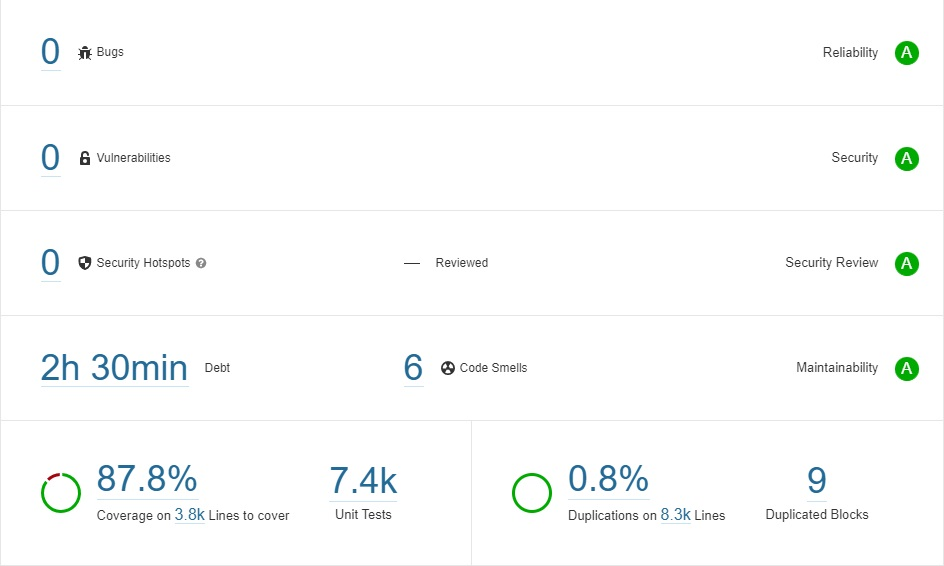

# Crypto-Primitives

## What is the content of this repository?

Cryptographic algorithms play a pivotal role in the Swiss Post Voting System: ensuring their faithful implementation is crucially important. The crypto-primitives library provides a robust and misuse-resistant library implementing some of the Swiss Post Voting System's cryptographic algorithms. We base our library upon a mathematically [precise and unambiguous specification](Crypto-Primitives-Specification.pdf). Our pseudo-code description of the cryptographic algorithms - inspired by [Haenni et al.](https://arbor.bfh.ch/13834/) – aims to bridge the representational gap between mathematics and code.

An essential part of the crypto-primitives library is the implementation of the [Bayer-Groth Mix net](http://www0.cs.ucl.ac.uk/staff/J.Groth/MinimalShuffle.pdf). Verifiable mix nets underpin most modern e-voting schemes since they hide the relationship between encrypted votes (potentially linked to the voter's identifier) and decrypted votes. A re-encryption mix net consists of a sequence of mixers, each of which shuffles and re-encrypts an input ciphertext and returns a different ciphertext list containing the same plaintexts. Each mixer proves knowledge of the permutation and the randomness (without revealing them to the verifier). The verifier checks these proofs to guarantee that no mixer added, deleted, or modified a vote.

We augment our specification with test values obtained from an independent implementation of the pseudo-code algorithms: our code validates against [these test values](./src/test/resources) to increase our confidence in the implementation's correctness. The specification embeds the test values as JSON files within the document.

## Under which license is this code available?

The Crypto-primitives are released under Apache 2.0.

## Changes since publication in 2019

We re-implemented the Bayer-Groth mix net with the following objectives in mind:

* making the specification and the code easier to audit
* providing a misuse resistant library to the e-voting developers
* reducing the number of external dependencies and future maintenance costs
* laying the groundwork for future performance optimizations of mathematical operations

## Code Quality

We strive for excellent code quality to minimize the risk of bugs and vulnerabilities. We rely on the following tools for code analysis.

| Tool        | Focus                 |
|-------------|-----------------------|
| [SonarQube](https://www.sonarqube.org/)  | Code quality and code security      |
| [Fortify](https://www.microfocus.com/de-de/products/static-code-analysis-sast/overview)  | Static Application Security Testing    |
| [JFrog X-Ray](https://jfrog.com/xray/) | Common vulnerabilities and exposures (CVE) analysis, Open-source software (OSS) license compliance | |

### SonarQube Analysis

We parametrize SonarQube with the built-in Sonar way quality profile. The SonarQube analysis of the crypto-primitives code reveals 0 bugs, 0 vulnerabilities, 0 security hotspots, and 6 code smells.

The 6 code smells concern duplicated blocks in the argument and proof classes. We left the code blocks as is since removing them reduces the code's readability.

Moreover, a high test coverage illustrates the fact that we extensively test the crypto-primitives library.

### Fortify Analysis

The Fortify analysis showed 0 critical, 1 high, 0 medium, and 62 low criticality issues. We manually reviewed all 63 issues and assessed them as false positives.

### JFrog X-Ray Analysis

The X-Ray analysis indicates that none of the crypto-primitives' 3rd party dependencies contains known vulnerabilities or non-compliant open source software licenses. As a general principle, we try to minimize external dependencies in cryptographic libraries and only rely on well-tested and widely used 3rd party components.

## Native Library Support

We support the GNU Multi Precision Arithmetic Library (GMP) for arbitrary-precision integer operations (called BigInteger in the Java programming language). GMP speeds up certain mathematical operations such as modular exponentiation. We recommend the [article by Haenni, Locher, and Gailly](https://e-voting.bfh.ch/app/download/7833228661/HLG19.pdf?t=1601370067) for an overview of popular optimization techniques.

_Linux:_

* Assuming [GMP](https://gmplib.org/) is installed this change should be transparent. If not, install GMP with the relevant package manager.
* No further action is required to benefit from native code optimisations.

_Windows:_

* Create GMP.dll: Build [GMP](https://gmplib.org/) for the relevant Windows architecture.
* Crypto-primitives, building with Maven :
  * Set the environment variable JNA_LIBRARY_PATH=\<location of gmp.dll>
* Crypto-primitives, usage as a third-party dependency
  * Add -Djna.library.path= \<location of gmp.dll> to the Java command line.

## Mathematical Variables Naming Convention

We aim for a mathematical naming convention that aligns with the following goals:

* have a consistent naming convention,
* make it easy to map visually between specification variables and code variables,
* guarantee an injective mapping from specification to code (but not necessarily from code to specification),
* prevent overloading common, simple variable names.

### Naming Convention Rules

| Naming Convention Rule                                                                                                                                                       | Argumentation                                                                                                                                                    |
|------------------------------------------------------------------------------------------------------------------------------------------------------------------------------|------------------------------------------------------------------------------------------------------------------------------------------------------------------|
| 1) Use only ASCII characters.                                                                                                                                                |                                                                                                                                                                  |
| 2) Use snake case.                                                                                                                                                           | Snake case allows to separate words and maintain case. It is not standard for Java but more practical for mathematical notations.                                |
| 3) Keep capitalization.                                                                                                                                                      | Even though capitalization may represent a dimension, it hurts the visual identification of the variable.                                                        |
| 4) Ignore bold fonts and superscript arrows. In case of disambiguation based on dimension, one can append "_vector" or "_matrix".                                            | Bold fonts and superscript arrows represent a dimension; since a variable's type already indicates its dimension, we do not repeat it in the variable's name.    |
| 5) Convert non-Latin characters to their Latin equivalent.                                                                                                                   |                                                                                                                                                                  |
| 6) Capitalize the first letter of Greek characters according to the Greek capitalization.                                                                                    | To differentiate lowercase from uppercase Greek letters.                                                                                                         |
| 7) Everything above a character is considered superscript.                                                                                                                   |                                                                                                                                                                  |
| 8) Append subscripts then superscripts. Apply this rule recursively if needed.                                                                                               |                                                                                                                                                                  |
| 9) Getter, setter and build methods for mathematical variables must use the get_, set_, with_ prefix followed by the variable name.                                          | This rule guarantees consistency with the naming of variables.                                                                                                   |
| 10) Method parameters' names should follow Java best practices. Subsequently, the algorithm implementation converts the parameters' names to the mathematical convention.    | Keep methods readable and self-documented while keeping the specification and implementation aligned.                                                            |
| 11) Keep numeric symbols in mathematical variables, except if the full variable name consists of a numeric symbol, in which case we use the fully spelled out equivalent.    |                                                                                                                                                                  |
| 12) Spell out symbols in the mathematical variable names.

### Naming Convention Examples

## Changelog

An overview of all major changes within the published releases is available [here.](CHANGELOG.md)

## Future Work

We plan for the following improvements to the crypto-primitives library:

* Provide expanded information in test vectors (including the expected challenge).

## Additional Documentation

You can find additional documents related to the crypto-primitives in the following locations:

| Repositories | Content |
| :------- | :---- |
| [`System specification`](https://gitlab.com/swisspost-evoting/e-voting/e-voting-documentation/-/blob/master/System/System_Specification.pdf) | System Specification of the e-voting system.   |
| [`Voting protocol`](https://gitlab.com/swisspost-evoting/e-voting/e-voting-documentation/-/blob/master/Protocol/Swiss_Post_Voting_Protocol_Computational_proof.pdf) | The cryptographic protocol that describes the Swiss Post e-voting system in a mathematical form. |
| [`Voting System architecture`](https://gitlab.com/swisspost-evoting/e-voting/e-voting-documentation/-/blob/master/System/SwissPost_Voting_System_architecture_document.pdf) | Architecture documentation of the e-voting system. |
| [`Documentation overview`](https://gitlab.com/swisspost-evoting/e-voting/e-voting-documentation) | Overview of all documentations. |
